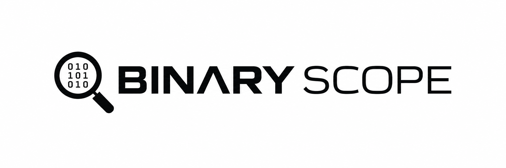

# BinaryScope

**Understand the structure beneath the executable.** BinaryScope is a C++20 / Qt 6
desktop application for static inspection of Windows PE files. It brings headers,
sections, symbols, strings, hex bytes, disassembly and entropy into one focused dark
workspace.

Analyzed files are opened as data snapshots. BinaryScope does not load them as
modules, start processes from them, or execute their code.



## Features

- **Overview:** full path, file size, SHA-256, MD5, architecture, PE32/PE32+ type,
  preferred image base, entry point, COFF timestamp, subsystem and section count.
- **Manual PE parser:** checked little-endian reads, DOS/NT/COFF/optional headers,
  data directory locations, raw-backed RVA translation and readable diagnostics.
- **Sections:** virtual and raw ranges, characteristics, permissions, zero-fill
  size and Shannon entropy.
- **Imports and exports:** DLL/name filtering, ordinal imports, IAT RVAs, export
  aliases, ordinal-only exports, address-table holes and forwarded exports.
- **Strings:** ASCII and null-terminated UTF-16LE at both byte alignments,
  minimum length and encoding controls, asynchronous search and full-string copy.
- **Hex viewer:** custom-painted visible rows, complete-file scrolling, offset
  jumps, byte/text search, overlapping matches, wrapping, keyboard selection and
  hex/text copying. No widget or table item is allocated per byte.
- **Disassembly:** optional Capstone 5.0.6 for x86, x86-64 and ARM64, section/RVA
  selection, entry-point navigation and background decoding.
- **Entropy:** numerical values and bars from 0 to 8 bits per byte, with contextual
  interpretation rather than packing or malware verdicts.
- **Desktop UX:** drag-and-drop, global search, progress stages, remembered window
  geometry/page, last open directory and string preferences.

## Technology

C++20, Qt 6 Widgets and Concurrent, CMake, and the standard library. Qt provides
hashing and the desktop infrastructure. Capstone is the only optional analysis
dependency; its pinned archive is verified with SHA-256 during configuration.
The default build enables it for useful instruction decoding.

## Architecture

```text
src/
  main.cpp                   Application entry point
  core/
    BinaryFile               Owned, read-only file snapshot
    ByteReader               Checked little-endian scalar reads
    HashCalculator           Chunked SHA-256 / MD5
    AnalysisResult           Immutable shared analysis snapshot
    AnalysisService          Background pipeline and readable errors
  pe/
    PEHeaders                Format-specific value types
    PEParser                 DOS, NT, optional headers and sections
    PESymbolParser           Bounded imports, exports and forwarders
  analysis/
    StringExtractor          Compact string offset index
    ByteSearch               Byte-pattern matching
    EntropyAnalyzer          Shannon entropy
    Disassembler             Backend interface and isolated implementations
  ui/
    MainWindow               Window composition, file workflow and navigation
    MainWindowActions        Global search and preferences dialogs
    TablePage                Lazy table model, filters and clipboard support
    OverviewWidget           Identity and metadata
    PEWidgets                Header, section, import and export views
    StringsWidget            Cancellable background filtering
    HexWidget                Virtualized hex painting and range selection
    EntropyWidget            Entropy bars and interpretation
    DisassemblyWidget        Background decoding and address controls
    Theme                    Shared Scope Dark styling
tests/
  CoreTests.cpp              Synthetic valid/corrupt fixtures and analysis tests
  UiTests.cpp                Qt workflow, clipboard, search and error tests
```

`binaryscope_core` has no Qt dependency. ELF can later provide its own parser and
metadata adapter while reusing file loading, byte search, strings, entropy and
disassembly. PE-specific concepts stay in `pe/` and the PE views.

The parser does not reinterpret file bytes as native PE structs. Range checks use
subtraction before reads, and RVAs never silently become offsets. Optional damaged
symbol directories generate warnings while preserving useful header inspection.
Core layout corruption rejects the image. UI objects follow Qt parent ownership;
analysis snapshots use shared const ownership, and backend resources use RAII.

## Build on Windows

Requirements:

- Visual Studio 2022 or 2026 with **Desktop development with C++** and a Windows SDK.
- CMake 3.24+ (3.25+ for the included preset schema; a current CMake for VS 2026).
- Qt 6.5+ for MSVC x64, including Widgets, Concurrent and Test when tests are enabled.
- Network access for the initial Capstone fetch, unless it is disabled or supplied
  locally through `FETCHCONTENT_SOURCE_DIR_CAPSTONE`.

From PowerShell, with CMake on PATH:

```powershell
$env:QT_ROOT = 'C:\Qt\6.8.3\msvc2022_64'
cmake -S . -B build -G 'Visual Studio 17 2022' -A x64 "-DCMAKE_PREFIX_PATH=$env:QT_ROOT"
cmake --build build --config Release
ctest --test-dir build -C Release --output-on-failure
cmake --install build --config Release --prefix "$PWD/dist"
.\dist\bin\BinaryScope.exe
```

For Visual Studio 2026, use `-G 'Visual Studio 18 2026'`, or the supplied presets:

```powershell
cmake --preset windows
cmake --build --preset windows
ctest --preset windows
```

Use an absolute installation prefix, as required by Qt's deployment script.
Windows builds also deploy the matching Debug or Release Qt DLLs and platform
plugin beside the build executable, so direct launches and CLion Run work without
adding the Qt SDK to PATH.
The installation step deploys the Qt runtime and platform plugin. Keep the entire
`dist` directory together when moving the application. Do not move only the EXE;
its Qt DLLs and platform plugin must remain available.

In CLion, open this directory as a CMake project, select an MSVC toolchain, and set
`CMAKE_PREFIX_PATH` to the matching Qt SDK. Do not mix a MinGW Qt SDK with MSVC.

### Dependency-free core and minimal decoder

```powershell
cmake -S . -B build-core -G 'Visual Studio 17 2022' -A x64 `
  -DBINARYSCOPE_BUILD_UI=OFF -DBINARYSCOPE_WITH_CAPSTONE=OFF
cmake --build build-core --config Release
ctest --test-dir build-core -C Release --output-on-failure
```

With the UI enabled and Capstone disabled, the disassembly page uses a deliberately
small x86 decoder (register push/pop, nop, ret, int3, leave). It stops at an
unsupported instruction rather than guessing its length.

## Usage

1. Use **Open Binary**, **Ctrl+O**, or drop a local `.exe` / `.dll` onto the window.
2. Follow background analysis progress, then select an inspection page.
3. Filter imports, exports and strings using their local search fields.
4. Use **Ctrl+F** to choose a symbol/text search or jump by VA, RVA or file offset.
5. In Hex Viewer, enter complete hex pairs (`4D 5A`) or choose UTF-8 / UTF-16LE text.
6. In Disassembly, choose an executable section, enter an RVA, or select Entry point.

| Shortcut | Action |
| --- | --- |
| Ctrl+O | Open binary |
| Ctrl+R | Reload the last successfully loaded file |
| Ctrl+F | Global search / address navigation |
| Ctrl+C | Copy selected table cells or hex bytes |
| Ctrl+Shift+C | Copy hex selection as Latin-1 text |
| Shift + arrows | Extend hex selection |
| Ctrl+A | Select the complete binary in Hex Viewer |
| Ctrl+Home / Ctrl+End | First / last byte in Hex Viewer |

All address inputs are hexadecimal. An **RVA** is relative to the preferred image
base; a **VA** includes that base; a **file offset** addresses physical bytes.
Virtual zero-fill has no file offset. The certificate directory uses a file offset,
unlike the RVA used by other PE directories.

## Validation

Core tests cover PE32/PE32+, every truncation boundary in a minimal fixture,
invalid signatures, unsafe ranges, corrupted directories, import ordinals, export
forwarders and holes, 4,000 deterministic mutated files, string alignments,
byte-search boundaries, known entropy values and instruction decoding.

Qt tests exercise an actual window and worker pipeline, known hash vectors,
readable file errors, all nine pages, string filtering, hex copying, global offset
search, reloading and persisted geometry. The test executable is inspected as data.
No analyzed fixture is executed. A 64 MiB appended-data test checks UI timer
responsiveness and access to the end of the enlarged file.

To produce development screenshots while running the Qt tests:

```powershell
$env:BINARYSCOPE_SCREENSHOT_DIR = "$PWD/docs/screenshots"
ctest --test-dir build -C Release -R ui_tests --output-on-failure
```

## Current limitations

- PE images only. No ELF, Mach-O, archives or COFF object-file inspection yet.
- Files are read into memory; maximum snapshot size is **1 GiB**. Memory usage also
  includes analysis indices and, during reload, the previous snapshot.
- Strict section validation rejects overlaps and some unusual images that Windows
  or permissive forensic tools may accept. The parser is not a Windows loader emulator.
- Regular imports only; delay imports, bound-IAT recovery, resources, TLS, relocation
  contents, debug symbols and .NET metadata are not decoded. Their directories remain visible.
- A maximum of 4,096 import descriptors, 500,000 import/export table entries and
  32 MiB of symbol text is accepted. Limit failures appear as warnings.
- String extraction is heuristic: UTF-16LE requires a null terminator and uses
  selected BMP ranges, without surrogate-pair/emoji support. Random bytes can look
  like text. The index is capped at 1,000,000 entries and indexes ASCII first.
- String previews show 4,096 characters. Full-string copy is limited to 8 million
  code units; hex clipboard selections to 16 MiB. These limits protect responsiveness.
- Disassembly is a linear view capped at 20,000 instructions per request. It does
  not establish code/data boundaries, detect functions, follow control flow or decompile.
- COFF timestamps are untrusted metadata and may be reproducible-build identifiers.
  Entropy is descriptive; it is not a malware detector. MD5 is for identification only.
- Windows x64 is the tested desktop target. ARM64 refers to analyzed images, not a
  validated native ARM64 build of the application.

## Roadmap

- ELF support
- Mach-O support
- Improved disassembly and navigation
- Cross references
- Function detection
- Symbol support
- Binary comparison
- Plugin system
- Memory-mapped large-file storage and richer Unicode extraction

## References and third-party components

- [Microsoft PE/COFF specification](https://learn.microsoft.com/en-us/windows/win32/debug/pe-format)
- [Qt CMake deployment](https://doc.qt.io/qt-6/cmake-deployment.html)
- [Capstone C API](https://www.capstone-engine.org/lang_c.html)

See [THIRD_PARTY.md](THIRD_PARTY.md) for dependency licensing notes.
